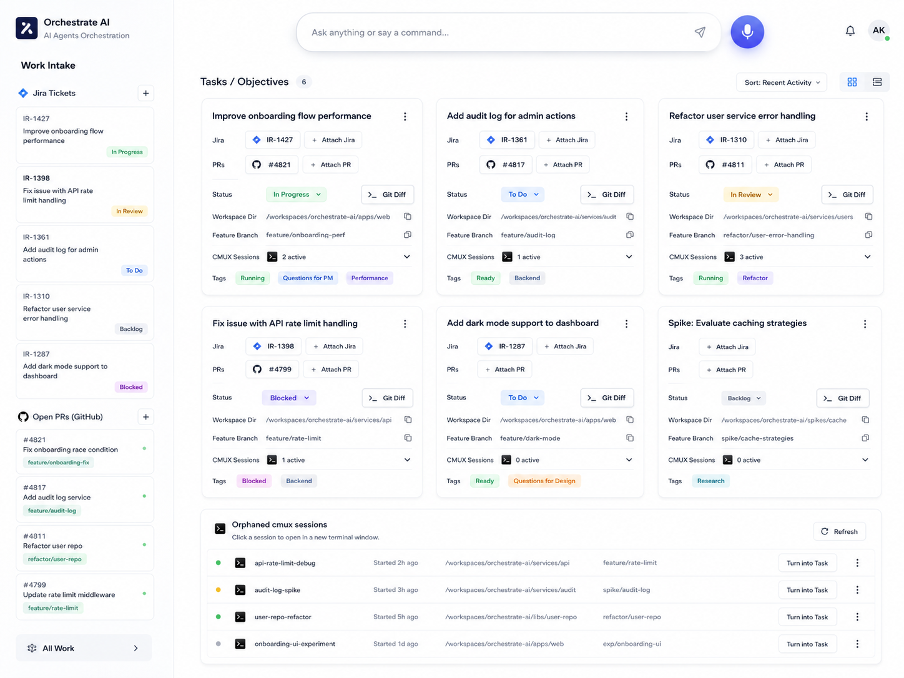
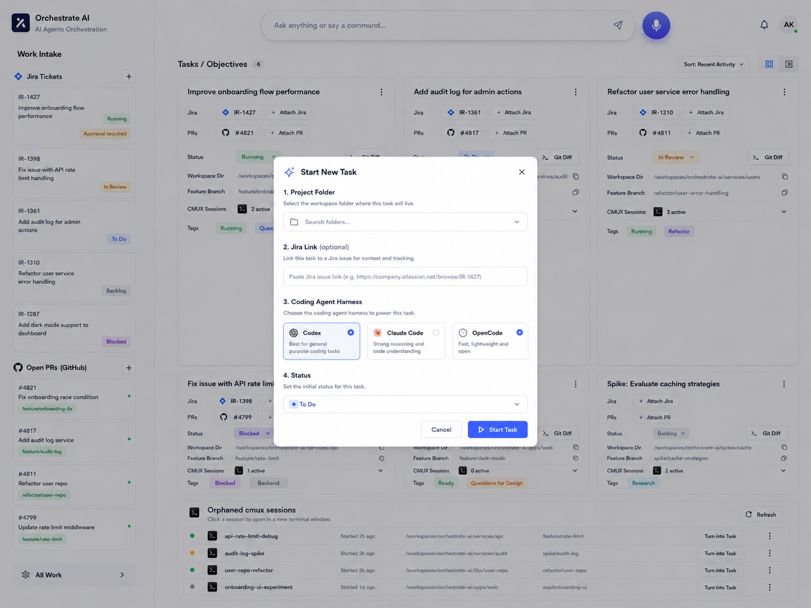
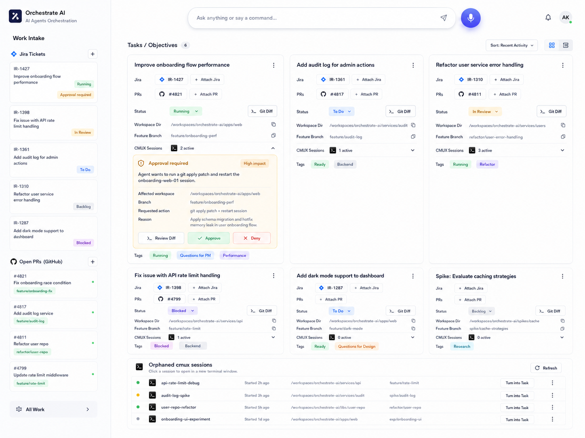
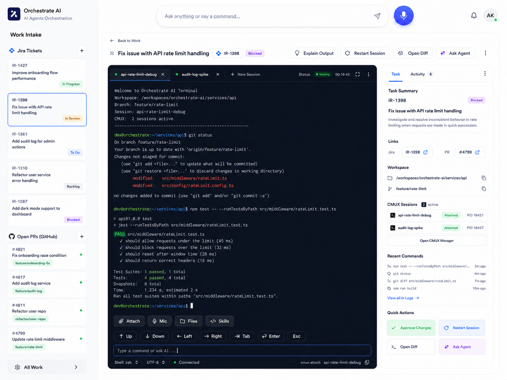
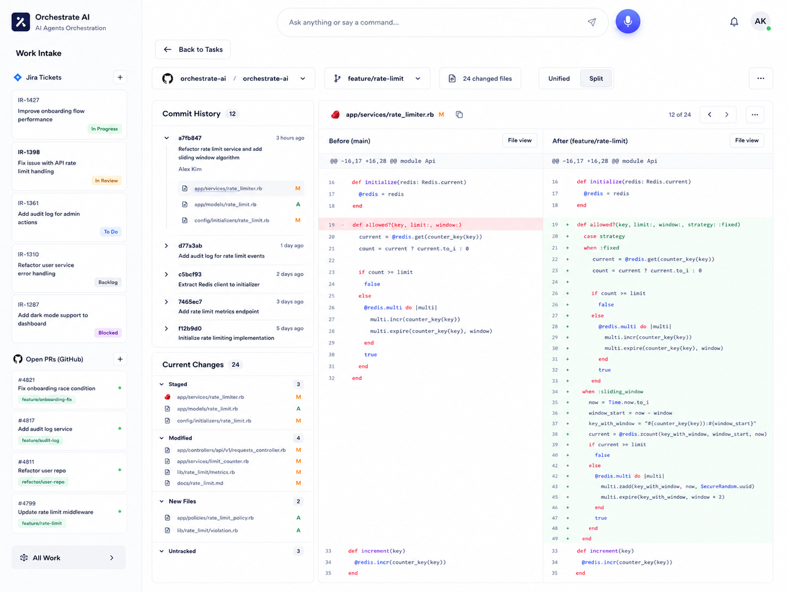
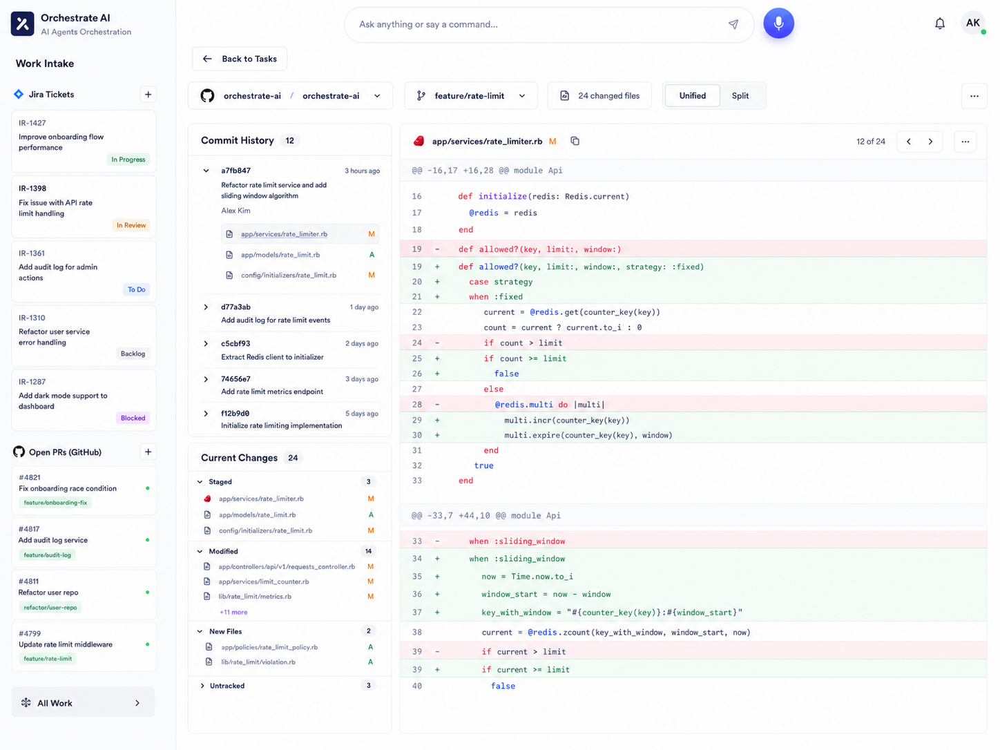

# Orchestrator V2 Design Guide

This guide packages the six UI reference screenshots Ronnie provided for Orchestrator V2. Use these as the visual target for the first implementation pass.

The goal is a dense, calm, work-focused dashboard. Keep the interface useful before decorative. The screenshots show an app for repeated daily use, not a marketing page.

## Screenshot Assets

- [01 Home Task Board](assets/orchestrator-v2/01-home-task-board.png)
- [02 New Task Modal](assets/orchestrator-v2/02-new-task-modal.png)
- [03 Home Approval Card](assets/orchestrator-v2/03-home-approval-card.png)
- [04 cmux Session View](assets/orchestrator-v2/04-cmux-session-view.png)
- [05 Git Diff Split](assets/orchestrator-v2/05-git-diff-split.png)
- [06 Git Diff Unified](assets/orchestrator-v2/06-git-diff-unified.png)

## Global Layout

The app uses a persistent left rail and a large primary work surface.

Left rail:

- Fixed width around 280px.
- Light background, subtle right border.
- App identity at top: square logo, `Orchestrate AI`, subtitle `AI Agents Orchestration`.
- Section title `Work Intake`.
- Stacked intake sections with compact cards.
- Bottom `All Work` navigation item.
- Must be collapsible in V2 implementation, even though these screenshots show the expanded state.

Top command area:

- Centered chat/command input at the top of the main area.
- Input placeholder: `Ask anything or say a command...`
- Send icon inside the input on the right.
- Large circular microphone button next to the input.
- Notification bell and user avatar on the far right.

Main content:

- White or near-white background.
- Thin gray borders, soft shadows, 8px or less card radius.
- Dense information hierarchy with readable spacing.
- Blue is used for active controls and primary actions.
- Green means running/healthy/approved.
- Amber means review/approval attention.
- Purple means blocked or special state.
- Red means denied/destructive/error.

## 01 Home Task Board

Purpose:

- Main dashboard for daily orchestration.
- Shows Ronnie's intake on the left, local Tasks/Objectives in the center, and orphan cmux sessions at the bottom.

Visible structure:

- Left rail has `Jira Tickets` and `Open PRs (GitHub)`.
- Jira ticket cards show issue key, short title, and status pill.
- PR cards show PR number, title, branch pill, and a small green status dot.
- Main header reads `Tasks / Objectives` with a count pill.
- Header controls include `Sort: Recent Activity`, grid/list toggle icons.
- Task cards are in a 3-column grid.
- Orphan cmux sessions are in a full-width panel below the grid.

Task card anatomy:

- Title at top left.
- Overflow menu at top right.
- Jira row with attached ticket chip and `Attach Jira` button.
- PR row with attached PR chip and `Attach PR` button.
- Status row with dropdown pill.
- `Git Diff` button on the right side of the status row.
- Workspace directory row with copy icon.
- Feature branch row with copy icon.
- cmux sessions row with terminal icon, active count, and expand chevron.
- Tags row with compact colored pills.

Implementation notes:

- The task card itself should not navigate yet. Individual CTAs open the relevant flows.
- Keep card density high enough to show six tasks above the orphan panel on a desktop viewport.
- `Done` and `Archived` tasks should not appear on this active board.
- Orphan rows should support `Turn into Task` and overflow actions.

## 02 New Task Modal

Purpose:

- Start a new local Task and immediately create the backing cmux workspace/session.

Visible structure:

- Full-page dim overlay over the dashboard.
- Center modal with close button.
- Title: `Start New Task`.
- Numbered form sections.
- Footer actions: `Cancel` and primary `Start Task`.

Fields shown:

- `1. Project Folder`
  - Search/select control with folder icon and placeholder `Search folders...`.
- `2. Jira Link (optional)`
  - Text input for a Jira issue URL.
- `3. Coding Agent Harness`
  - Three selectable option cards: `Codex`, `Claude Code`, `OpenCode`.
- `4. Status`
  - Dropdown defaulting to `To Do`.

V2 adjustments from later product decisions:

- Workspace/project folder is required.
- Add `priority` as a required field.
- Add `Empty shell` as a fourth launch option.
- Jira remains optional.
- The system must not silently choose a coding agent if the user did not specify one. UI default can be Empty shell.
- Task creation should also create the task goal markdown file from the template.

Implementation notes:

- Keep the modal compact and centered.
- The background should remain recognizable but visually subordinate.
- Option cards should be keyboard accessible and behave like a radio group.

## 03 Home Approval Card

Purpose:

- Show approval needs inline on the task board without forcing Ronnie into another page.

Visible structure:

- Same home board as screenshot 01.
- First task card expands its cmux/session area to show an approval panel.
- The left rail Jira card for `IR-1427` includes an `Approval required` pill.

Approval panel anatomy:

- Amber bordered panel inside the task card.
- Header with shield icon, `Approval required`, and `High impact` pill.
- Short request summary: agent wants to run a git apply patch and restart a session.
- Detail rows:
  - affected workspace
  - branch
  - requested action
  - reason
- Actions:
  - `Review Diff`
  - `Approve`
  - `Deny`

Implementation notes:

- Approval cards should appear where the work context lives.
- External posts, PR replies/reviews, destructive git, and kill/restart actions require approval.
- Jira transitions do not require approval by product decision, but comments do.
- Approval actions should also emit audit events and activity/toast events.

## 04 cmux Session View

Purpose:

- Embedded cmux terminal/session view inside the orchestrator, replacing the center task board.

Visible structure:

- Left rail remains visible.
- Main content starts with `Back to Work`.
- Header shows task title, Jira chip, and status pill.
- Header actions: `Explain Output`, `Restart Session`, `Open Diff`, `Ask Agent`, overflow menu.
- Center-left contains a large terminal panel with tabbed sessions.
- Right side contains a task detail sidebar with `Task` and `Activity` tabs.

Terminal panel:

- Dark terminal theme.
- Tabs show active cmux sessions, with active green dots and close icons.
- `New Session` tab/button.
- Top-right terminal status shows running state and elapsed time.
- Terminal output includes workspace, branch, session, active session count, git status, and test output.
- Bottom controls include Attach, Mic, Files, Skills, directional keys, Tab, Enter, Esc, command input, shell selector, encoding, connected state.

Right sidebar:

- Task summary with Jira key, status pill, task title, and short description.
- Links section with Jira and PR chips.
- Workspace path and branch rows with copy icons.
- cmux sessions list with attached pills and PIDs.
- `Open CMUX Manager` button.
- Recent commands list with relative timestamps.
- Quick actions: `Approve Changes`, `Restart Session`, `Open Diff`, `Ask Agent`.

Implementation notes:

- This view should use the primary center area, not a drawer.
- Multiple cmux panes/surfaces for one task should show as terminal tabs.
- Reading terminal output should be possible without changing cmux focus.
- Restart/kill actions require approval.

## 05 Git Diff Split

Purpose:

- Full diff review route with side-by-side comparison.

Visible structure:

- Left rail remains visible.
- Top has `Back to Tasks`.
- Filter/control row includes repo selector, branch selector, changed files count, unified/split toggle, overflow menu.
- Left column inside main area has `Commit History` and `Current Changes`.
- Main right area shows selected file diff in split mode.

Left diff sidebar:

- `Commit History` count pill.
- Commit rows with hash, message, author, relative time, and expandable file list.
- `Current Changes` count pill.
- Sections for staged, modified, new files, and untracked.
- File rows show path and status marker such as `M` or `A`.

Split diff panel:

- File header shows path, status, copy icon, position count `12 of 24`, navigation arrows, and overflow menu.
- Two columns:
  - `Before (main)`
  - `After (feature/rate-limit)`
- Removed lines use red background.
- Added lines use green background.
- Monospace code with line numbers and syntax coloring.
- Each side has a `File View` button.

Implementation notes:

- Git diff should be a full center view for space.
- Preserve line alignment and independent file navigation.
- This view can be backed by read-only git diff APIs during automated testing.

## 06 Git Diff Unified

Purpose:

- Same diff route as screenshot 05, but unified diff mode.

Visible structure:

- Same shell, left rail, controls, commit history, and current changes as split mode.
- `Unified` segmented control is selected.
- Main diff panel uses a single code column.

Unified diff behavior:

- File header remains consistent with split mode.
- Hunk headers appear before code blocks.
- Removed lines are red.
- Added lines are green.
- Context lines remain white.
- Large files should scroll inside the main content area.

Implementation notes:

- Split/unified should be a stateful segmented control.
- The same file selection, navigation, and changed-file data should feed both modes.
- Keep left sidebar fixed enough that selecting files does not shift the diff content.

## Visual System Notes

Typography:

- Use a modern sans-serif for UI text.
- Use a monospace font for terminal and code diff.
- Avoid oversized headings inside cards and panels.
- Keep letter spacing normal.

Spacing:

- Favor dense, operational spacing.
- Use consistent row heights for cards and panels.
- Task card labels should align vertically.

Components:

- Icon buttons should use recognizable icons.
- Buttons should not resize based on loading or dynamic text.
- Status pills and tag pills should have stable heights and compact padding.
- Cards should use subtle borders and shadows.
- Avoid nested decorative cards.

Responsive behavior:

- Desktop is the primary target for V2.
- Left rail should collapse to a slimmer rail to recover horizontal space.
- Task grid can reduce from three columns to two or one on smaller screens.
- Diff and terminal views should prioritize the primary work surface over secondary sidebars on narrow viewports.

## Design Acceptance Checklist

- All six reference screenshots are represented by implemented states or routes.
- The home board shows the left intake rail, top command input, task grid, and orphan cmux sessions.
- New Task modal includes required workspace, title, status, priority, and launch type, plus optional Jira link.
- Approval cards appear inline on task cards and expose review/approve/deny actions.
- cmux session view embeds terminal tabs in the main center surface.
- Git diff has split and unified modes with the same surrounding layout.
- The UI stays dense, calm, and work-focused.
- No landing page, marketing hero, decorative orb background, or generic assistant sidebar dominates the app.
